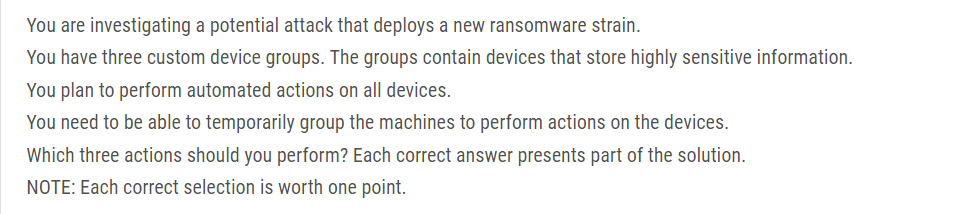
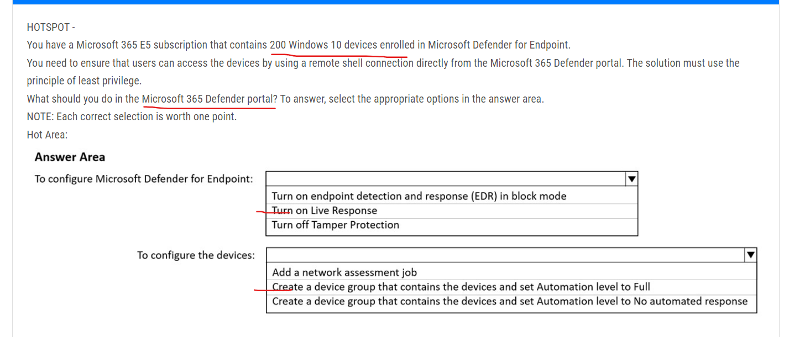
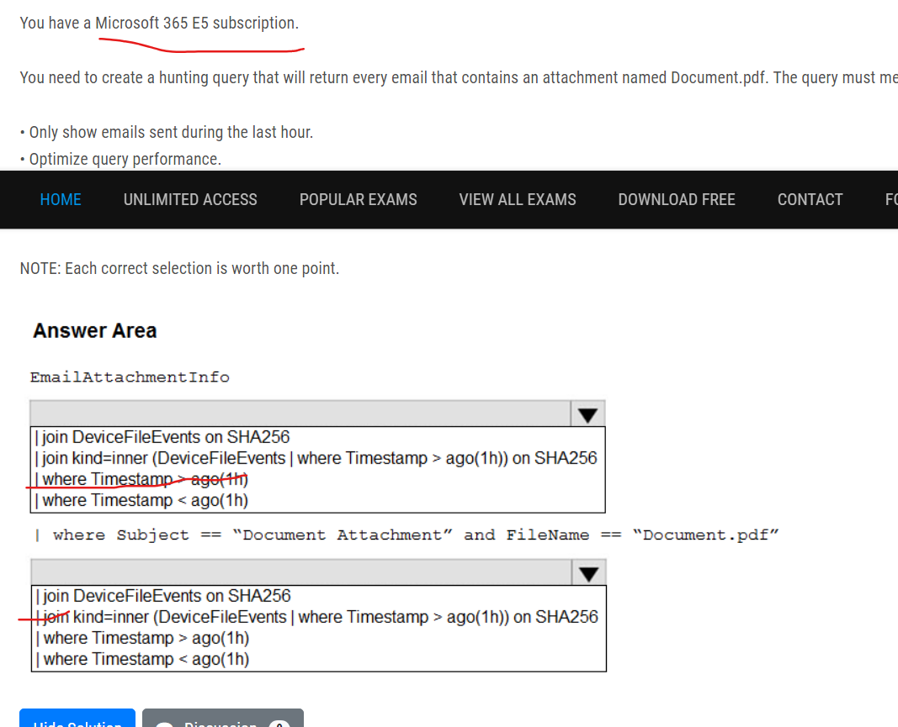

# sc-200
this for sc 200 exam 

Question 

### 1. You are investigating an incident by using Microsoft 365 Defender.You need to create an advanced hunting query to count failed sign-in authentications on three devices named CFOLaptop, CEOLaptop, and COOLaptop.How should you complete the query? To answer, select the appropriate options in the answer area.
NOTE: Each correct selection is worth one point.
Select and Place:

### 2. You need to receive a security alert when a user attempts to sign in from a location that was never used by the other users in your organization to sign in.Which anomaly detection policy should you use?

 _Activity from infrequent country_

### 3.  You have a Microsoft 365 subscription that uses Microsoft Defender for Office 365.You have Microsoft SharePoint Online sites that contain sensitive documents. The documents contain customer account numbers that each consists of 32 alphanumeric characters.You need to create a data loss prevention (DLP) policy to protect the sensitive documents.What should you use to detect which documents are sensitive?

_RegEx pattern matching_ & Azure Information Protection

### 4. Your company uses Microsoft Defender for Endpoint.The company has Microsoft Word documents that contain macros. The documents are used frequently on the devices of the company's accounting team.You need to hide false positive in the Alerts queue, while maintaining the existing security posture.Which three actions should you perform? Each correct answer presents part of the solution.
NOTE: Each correct selection is worth one point.

_Hide the alert_
_Create a suppression rule scoped to a device group_
_Generate the alert_

### 5. DRAG DROP -You open the Cloud App Security portal as shown in the following exhibit

### 6. You have a Microsoft 365 E5 subscription.You plan to perform cross-domain investigations by using Microsoft 365 Defender.You need to create an advanced hunting query to identify devices affected by a malicious email attachment.How should you complete the query? To answer, select the appropriate options in the answer area.
NOTE: Each correct selection is worth one point.

### 7. 

_Create a detection rule_
_Add DeviceId and ReportId to the output of the query_

### 8. 

_Assign a tag to the device group._
_ Add a tag to the machines_
_Create a new device group that has a rank of 1._

### 9. 

### 10. 

### 11. 

### 12. 

### 13. 

### 14. 

### 15. 

### 16. 

### 17. 

### 18. 

### 19. 

### 20. 

### 21. 

### 22. 

### 23. 

relatable 

### 24. 

### 25. 

### 26. 

### 27. 

### 28. 

### 29. 

### 30. 

### 31. 

### 32. 

### 33. 

### 34. 

### 35. 

### 36. 

### 37. 

### 38. 

### 39. 

### 40. Case study 

### 41. 

### 42. 

### 43. 

### 44. 

### 45. 

### 46. 

### 47. 

### 48. 

### 49. 

### 50. CASE STUDY 

### 51. 

### 52. 

### 53. 

### 54. 

### 55. 

### 56. 

### 57. 

### 58. 

### 59. 

### 60. 